<div align="center">

# CrossGeo Dataset

**Seeing Across Skies and Streets: Feedforward 3D Reconstruction from Satellite, Drone, and Ground Images**

<a href="https://scholar.google.com/citations?user=V61LSk0AAAAJ&hl=en">Qiwei Wang</a><sup>1,†</sup>,
<a href="https://scholar.google.com/citations?user=hJQA_NQAAAAJ&hl=en">Zhongyao Tuo</a><sup>1,†</sup>,
<a href="https://scholar.google.com/citations?user=N0hjZrAAAAAJ&hl=en">Xianghui Ze</a><sup>2</sup>,
<a href="https://scholar.google.com/citations?user=rVsRpZEAAAAJ&hl=en">Yujiao Shi</a><sup>1,‡</sup>

<sup>1</sup>ShanghaiTech University &nbsp;&nbsp; <sup>2</sup>Nanjing University of Science and Technology

<sup>†</sup>Equal contribution &nbsp;&nbsp; <sup>‡</sup>Corresponding author

[[`arXiv`](https://arxiv.org/abs/2605.07978)]
[[`Bibtex`](#citation)]

<a href="https://arxiv.org/abs/2605.07978"></a>
<a href="https://github.com/ZhongyaoTuo/crossgeo/actions/workflows/ci.yml"></a>
<a href="LICENSE"></a>


</div>

This repository is part of the **CrossGeo** project introduced in the paper above. It provides the **data construction pipeline** used to build the CrossGeo dataset — a large-scale tri-view (satellite / UAV / ground) dataset for cross-view 3D reconstruction and camera localization, spanning **85 scenes** across every continent except Antarctica with **277,812 images** in total.

> The same pipeline is **scalable to unlimited scenes**: given any GPS coordinate, it automatically downloads satellite imagery, renders UAV views, retrieves ground panoramas, recovers poses, computes depth, and forms tri-view pairs. You can use it to build your own dataset of any size.
## Overview

CrossGeo contains **277,812 images** (46,302 samples × 6 views) with full 6-DoF poses and dense metric depth across three modalities:

| Modality | Source | Collection |
|----------|--------|------------|
| Satellite | Google Maps | 300m × 300m tiles (FOV 5°, altitude 5726m) |
| UAV | Google Earth Studio | Rendered at altitude 30–120m, pitch 0°–90° (same as [AerialMegaDepth](https://github.com/kvuong2711/aerial-megadepth)) |
| Ground | Google Street View | **Pano IDs only** — images NOT redistributed (Google TOS) |

### Pipeline at a Glance

<div align="center">
  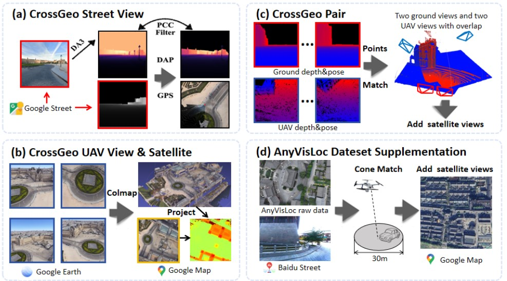
</div>

*(a) Ground views and coarse depth from Google Street View. (b) UAV captures rendered in Google Earth together with co-located satellite tiles from Google Maps. (c) Tri-view pairing across the three modalities. (d) AnyVisLoc test-set augmentation.*


## Data Structure

Each scene is organized as `{scene_id}_pair/{scene_id}_{altitude}_{pitch}/pair_{N}/`. Every pair contains **6 views** (2 ground + 2 UAV + 2 satellite):

```
pair_3/
├── quad_info.json                     # Pair metadata
├── ground_1_rgb.jpg                   # Ground RGB
├── ground_1_rgb.npy                   # Ground pose {intrinsics, c2w, raw_data}
├── ground_1_depth.tiff                # Ground depth (float32 TIFF)
├── ground_1_satellite.jpg             # Satellite tile (co-located)
├── ground_1_satellite_depth.tiff      # Satellite depth (Z-Buffer from UAV point cloud)
├── uav_1_rgb.jpg                      # UAV RGB
├── uav_1_depth.tiff                   # UAV depth (COLMAP MVS)
└── ...
```

### Pose Format (`*_rgb.npy`)

Python dict with: `intrinsics` (3×3), `c2w` (4×4 in EDS frame), `raw_data` `[pitch, roll, heading, lat, lon, alt]`.

### World Coordinate System (EDS)

**X** → South, **Y** → Down, **Z** → East
## Demo

A sample pair (pair 10) from scene `0005` (altitude 45m, pitch 60°) is included in [`demo/`](demo/) for quick inspection. Each modality has 2 views, shown as RGB + Depth:

<div align="center">

<table>
  <tr>
    <th>Modality</th>
    <th>View 1 — RGB</th>
    <th>View 1 — Depth</th>
    <th>View 2 — RGB</th>
    <th>View 2 — Depth</th>
  </tr>
  <tr>
    <td><b>Ground</b><br>(Street View pinhole)</td>
    <td>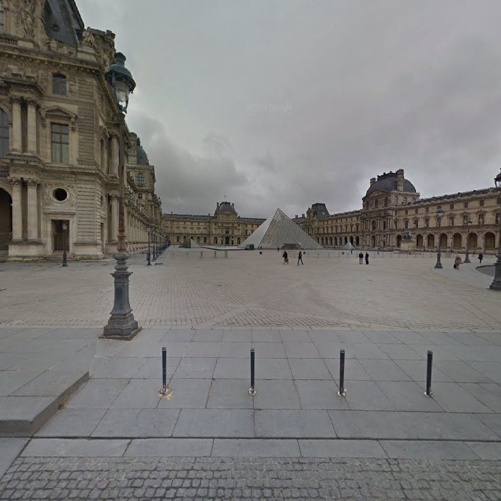</td>
    <td>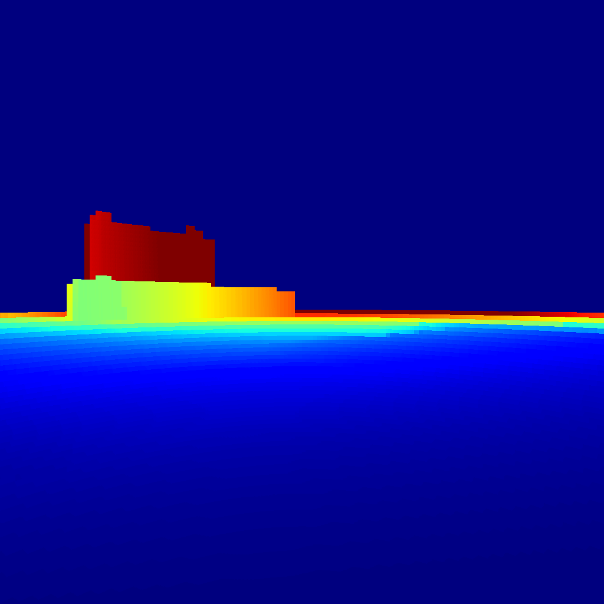</td>
    <td></td>
    <td>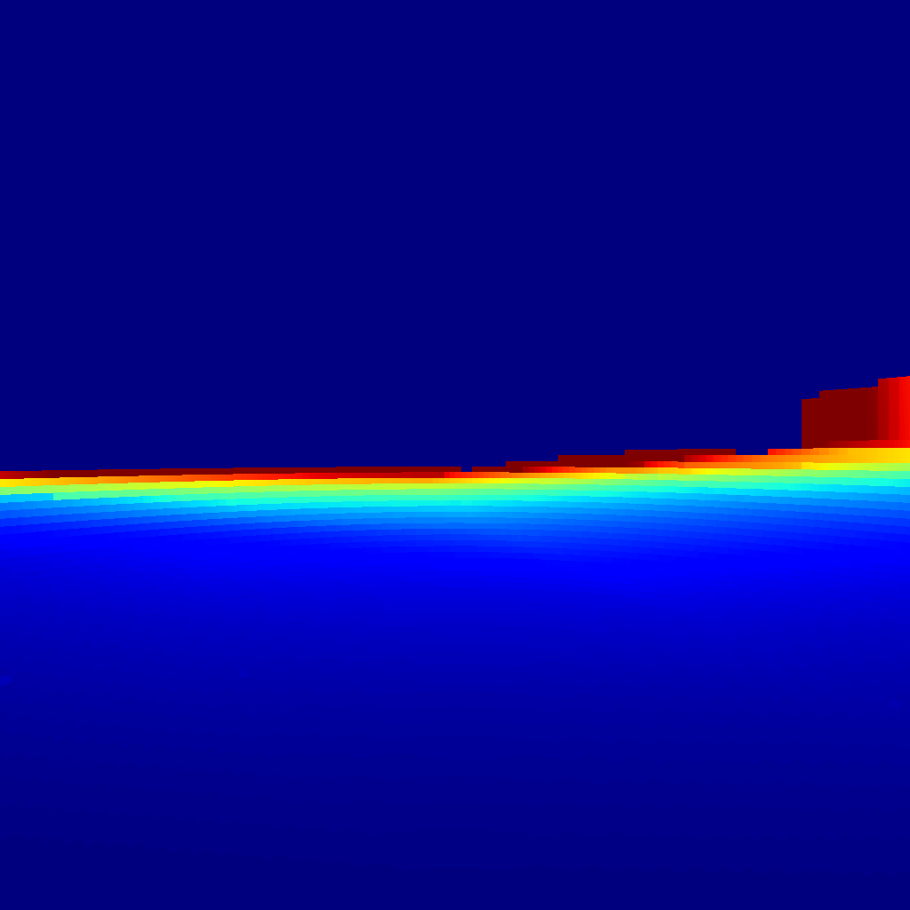</td>
  </tr>
  <tr>
    <td><b>UAV</b><br>(Google Earth render)</td>
    <td>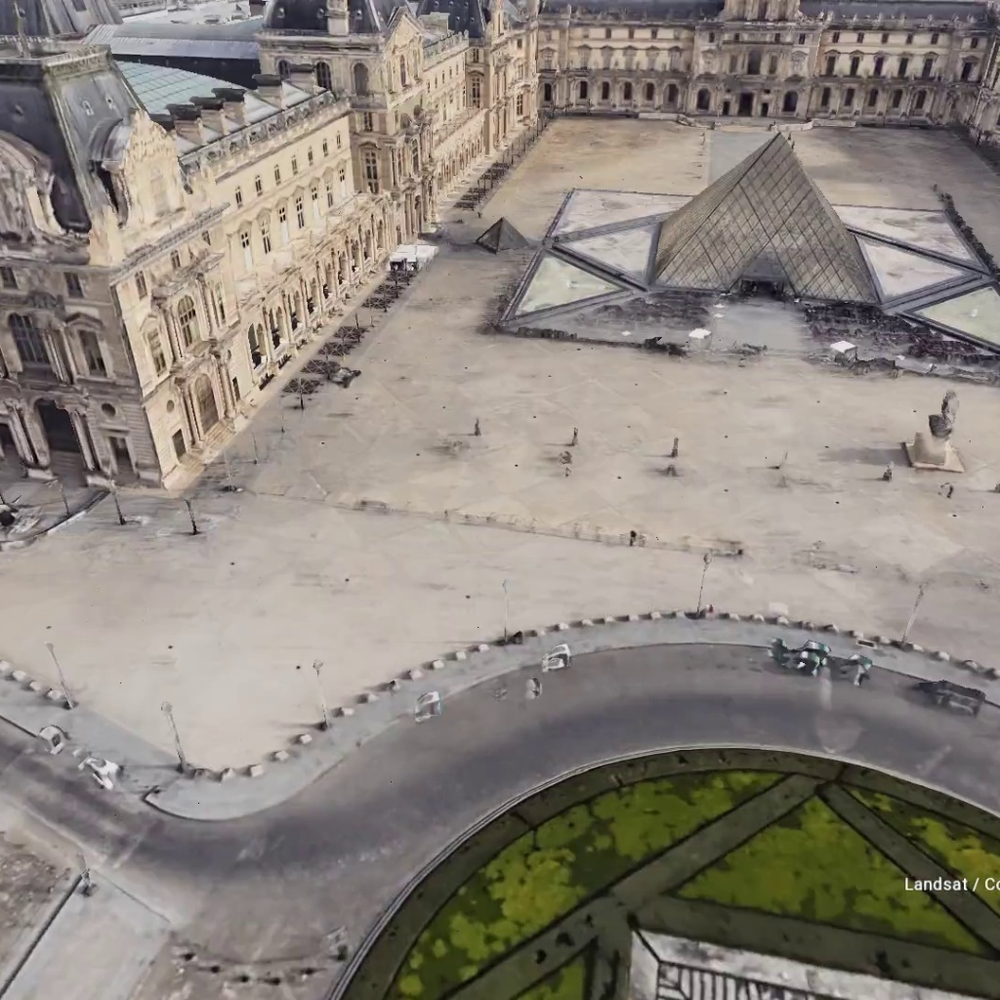</td>
    <td>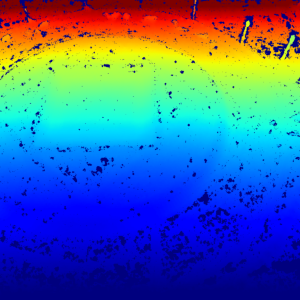</td>
    <td>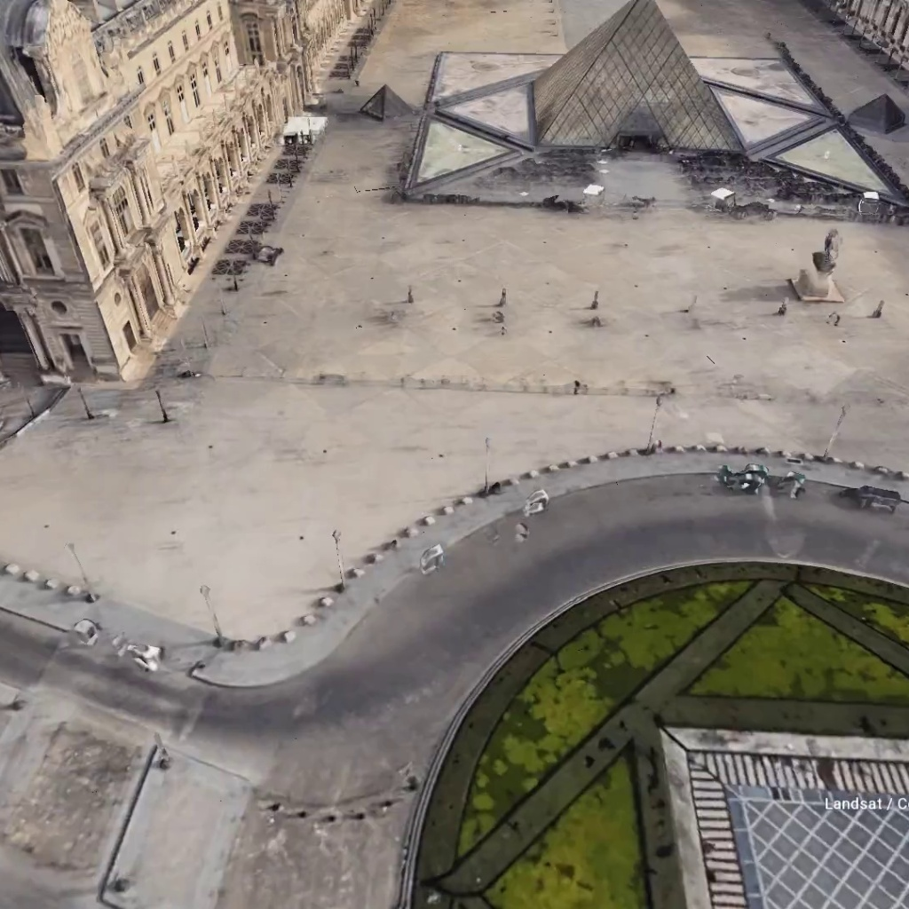</td>
    <td>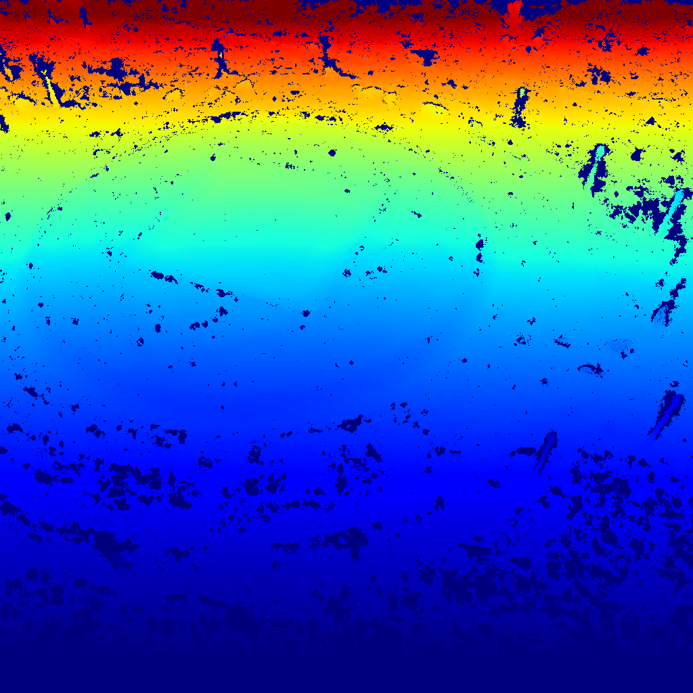</td>
  </tr>
  <tr>
    <td><b>Satellite</b><br>(Google Maps tile)</td>
    <td>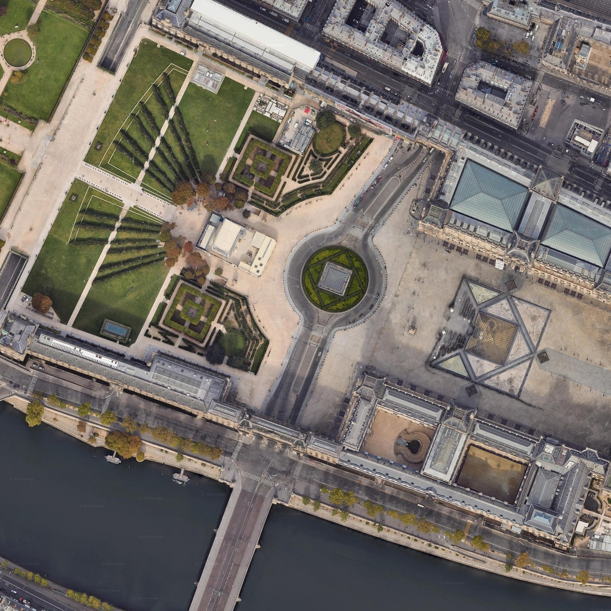</td>
    <td>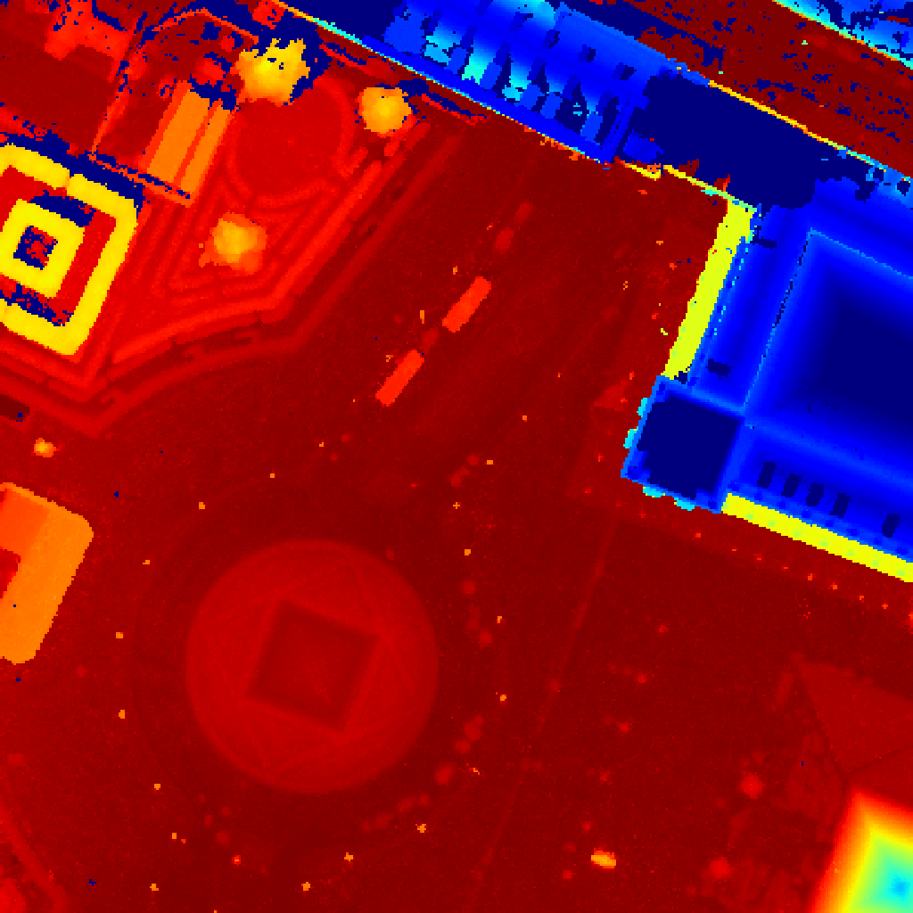</td>
    <td>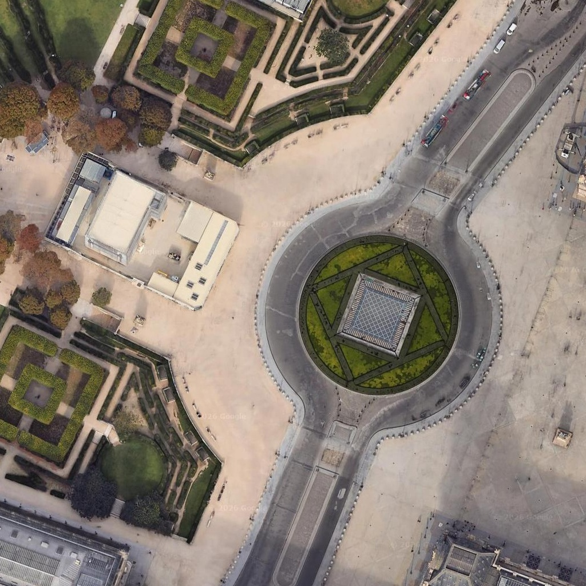</td>
    <td>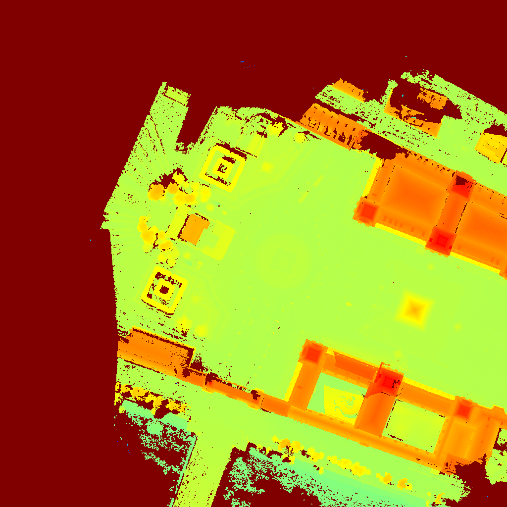</td>
  </tr>
</table>

</div>

See [`demo/quad_info.json`](demo/quad_info.json) for the pair metadata format. Full depth arrays (`.tiff`, `.npy`) are excluded from the repo — see the data structure below.

## Paper Scene Metadata (`paper85/`)

The [`paper85/`](paper85/) directory contains the **complete redistributable metadata** for all **85 scenes** in the paper — UAV flight trajectories, SfM reconstructions, and ground pano IDs:

| Item | Count | Format |
|------|-------|--------|
| UAV ESP trajectories | 425 | Google Earth Studio `.esp` |
| Reconstruction XML | 425 | Agisoft Metashape `.xml` |
| Ground pano IDs | 22,110 | JSON (`panoids.json` per scene) |

Each scene has **5 UAV routes** (`{altitude}_{pitch}`): `45_30`, `45_60`, `45_90`, `70_30`, `100_30`.

```bash
# Reproduce scene 0005: ground panoramas
python ground/download.py \
    --pano_list paper85/scenes/0005/ground/panoids.json \
    --output_dir data/ground/0005

# UAV: import paper85/scenes/0005/uav/esp/0005_45_60.esp into Google Earth Studio
#      to render imagery, then run COLMAP MVS for depth
```

See [`paper85/README.md`](paper85/README.md) for the full tutorial.

## Open-Source Status

| Component | Status | Notes |
|-----------|--------|-------|
| Satellite pipeline | ✅ Open source | `satellite/` (ref: [andolg/satellite-imagery-downloader](https://github.com/andolg/satellite-imagery-downloader)) |
| UAV pipeline | ✅ Open source | `uav/` (ref: [AerialMegaDepth](https://github.com/kvuong2711/aerial-megadepth)) |
| Ground pipeline | ✅ Open source | `ground/` (pano IDs only, no image redistribution) |
| Tri-view pairing | ✅ Open source | `utils/pairing/tri_view_pairing.py` |
| UAV flight trajectories (`.esp`) | ✅ Open source | `paper85/` — 425 ESP files (85 scenes × 5 routes) |
| Ground pano IDs | ✅ Open source | `paper85/` — 22,110 unique pano IDs |
| Pre-trained model (Cross3R) | 🔜 TODO | Will be released separately |

### Open-Source Scope & AnyVisLoc OOD Test Set

**This repository open-sources the CrossGeo training data construction pipeline only.** The real-world out-of-distribution (OOD) test set in the paper repurposes [**AnyVisLoc**](https://github.com/UAV-AVL/Benchmark) — a benchmark of UAV photographs captured by physical drones (CVPR 2026 Findings).

> **Why is AnyVisLoc not included here?** AnyVisLoc's coordinates are intentionally sanitized to protect geographic privacy: original UAV longitude/latitude are converted to UTM and then shifted to a local metric coordinate system, with heights shifted by the mean DSM elevation. **The original GPS coordinates are not publicly releasable.** Therefore, we only open-source the CrossGeo training set construction pipeline. Users who wish to evaluate on the OOD test set should obtain AnyVisLoc directly from its [official repository](https://github.com/UAV-AVL/Benchmark).
>
> **Important:** Per the AnyVisLoc ground-truth protocol, AnyVisLoc is designed for **horizontal visual localization only**. Do not use it for UAV height estimation or absolute-altitude estimation, as the released coordinates do not share a consistent elevation reference.

## Quick Start

### Installation

```bash
git clone --recursive https://github.com/ZhongyaoTuo/crossgeo.git
cd crossgeo
pip install -r requirements.txt
pip install git+https://github.com/cvg/Hierarchical-Localization.git  # hloc
```

### Collect a single scene

```bash
python pipeline.py --scene_config data/scenes/example.json
python pipeline.py --scene_config data/scenes/example.json --steps satellite ground
```

### Scale to more scenes

Add more scene config JSONs to `data/scenes/` and run:

```bash
python pipeline.py --split --scenes_dir data/scenes
```

### Step-by-step tutorials

- **[satellite/README.md](satellite/README.md)** — Download satellite tiles & recover poses
- **[uav/README.md](uav/README.md)** — Render UAV imagery in Google Earth Studio & recover depth
- **[ground/README.md](ground/README.md)** — Download Street View panoramas & refine depth
- **[utils/README.md](utils/README.md)** — Tri-view pairing, coordinate conversion, visualization
- **[paper85/README.md](paper85/README.md)** — Reproduce all 85 paper scenes (ESP trajectories, pano IDs, SfM XML)

## External Dependencies

| Folder (submodule) | Source Repository | Description |
|---------------------|-------------------|-------------|
| `satellite/satellite-imagery-downloader/` | [andolg/satellite-imagery-downloader](https://github.com/andolg/satellite-imagery-downloader) | Satellite RGB tile download |
| `uav/aerial-megadepth/` | [kvuong2711/aerial-megadepth](https://github.com/kvuong2711/aerial-megadepth) | UAV data collection (GE → COLMAP → MVS) |

## Acknowledgement

This codebase builds upon the following excellent open-source projects. We thank the respective authors for making their work publicly available:

- **[satellite-imagery-downloader](https://github.com/andolg/satellite-imagery-downloader)** — Satellite RGB tile download
- **[AerialMegaDepth](https://github.com/kvuong2711/aerial-megadepth)** — UAV data collection pipeline
- **[AnyVisLoc](https://github.com/UAV-AVL/Benchmark)** — Real-world OOD test set (UAV visual localization benchmark)
- **[Depth-Anything-3](https://github.com/Depth-Anything/Depth-Anything-3)** — Relative depth estimation
- **[Prior-Depth-Anything](https://github.com/sichengplus/Prior-Depth-Anything)** — Depth fusion
- **[hloc](https://github.com/cvg/Hierarchical-Localization)** — Feature extraction and matching

## Citation

If you find our work to be useful in your research, please consider citing our paper:

```bibtex
@article{wang2026crossgeo,
  title   = {Seeing Across Skies and Streets: Feedforward 3D Reconstruction from Satellite, Drone, and Ground Images},
  author  = {Wang, Qiwei and Tuo, Zhongyao and Ze, Xianghui and Shi, Yujiao},
  journal = {arXiv preprint arXiv:2605.07978},
  year    = {2026}
}
```

## License

- **Code**: MIT License (see [LICENSE](LICENSE))
- **Google Earth/Maps/Street View data**: Owned by Google, non-commercial research use only.
- **Street View images**: NOT redistributed. Only pano IDs are released.
